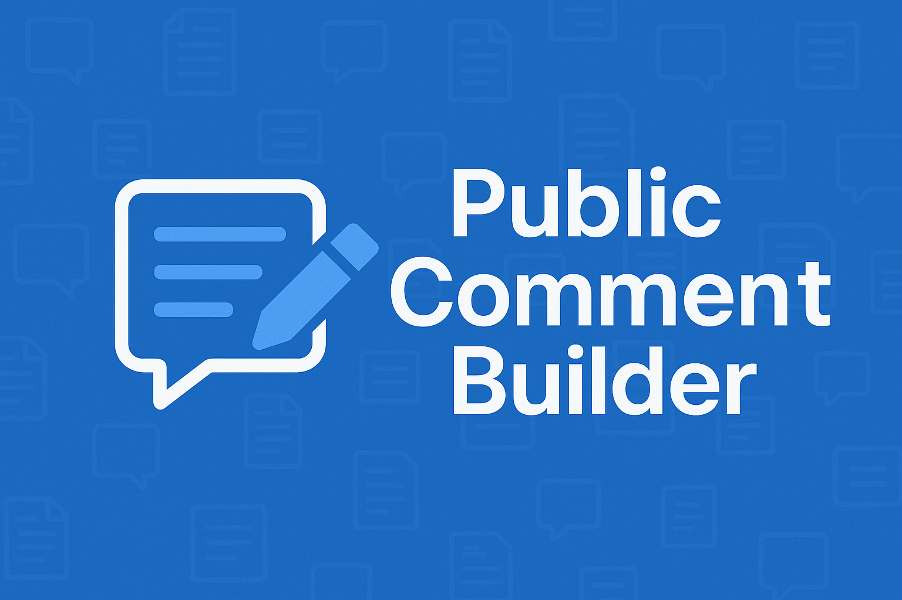

# Public Comment Builder

<p align="center">
  
</p>

A web application that helps citizens draft legally substantive public comments on federal regulations. Instead of writing generic "I support/oppose this" comments that agencies can easily dismiss, this tool helps you craft specific, evidence-based arguments that agencies must meaningfully address.

## How It Works

1. **Browse Regulations** - View federal regulations with upcoming comment deadlines from Regulations.gov
2. **Select Your Position** - Choose whether you support, oppose, or have mixed feelings about the proposal
3. **Build Your Argument** - Select from AI-generated reason cards aligned with federal evaluation criteria (cost-benefit analysis, distributional impacts, implementation concerns, etc.)
4. **Add Your Perspective** - Include your lived experience and personal context to strengthen your comment
5. **Generate & Submit** - Get a professionally formatted comment ready for submission to the agency

## Why This Matters

Federal agencies are legally required to respond to significant, substantive public comments under the Administrative Procedure Act. However, most public comments are easily dismissed because they:
- Simply state support or opposition without explanation
- Don't reference specific provisions in the regulation
- Lack concrete evidence or examples
- Don't suggest actionable alternatives

This tool helps you write comments that matter.

## Getting Started

### Prerequisites

- Node.js 18+
- Redis (optional, for caching)

### Installation

```bash
cd civic-engine
npm install
```

### Environment Variables

Create a `.env` file (see `.env.example`):

```env
# Google Gemini API (Required for AI features)
GOOGLE_API_KEY=your_api_key

# Admin Stats (Required for /admin/stats)
ADMIN_SECRET_KEY=secure_random_string

# App URL (Required for Sitemap/SEO)
NEXT_PUBLIC_APP_URL=http://localhost:3000

# Redis URL (Optional - for caching)
REDIS_URL=redis://localhost:6379
```

### Development

```bash
npm run dev
```

Open [http://localhost:3000](http://localhost:3000)

### Production Build

```bash
npm run build
npm start
```

## Architecture

### Two-Call AI Architecture

The app uses a streamlined two-call AI pattern:

1. **First Call (Analyze Docket)** - When you open a docket, the AI analyzes the full regulatory text and generates:
   - Plain-language summary
   - Commenting instructions (deadlines, format, submission methods)
   - Submission email extraction (if agency accepts email comments)
   - Deadline date extraction for comment period validation
   - **Notice type detection** (proposed_rule, pra_notice, rfi, or general)
   - Response framework appropriate to the notice type:
     - **Proposed Rules**: Support/oppose/mixed positions with reason cards
     - **PRA Notices**: Four PRA factor categories (necessity, burden accuracy, quality, burden minimization)
     - **RFIs/ANPRMs**: Question-based response cards
     - **General Notices**: Issue-based response cards

2. **Second Call (Generate Comment)** - After you select arguments, the AI drafts a formal comment incorporating:
   - Your selected reason cards
   - Personal context and expertise
   - Custom text you've added
   - Proper formatting based on the notice type

### Data & Stats

- **SQLite** (`data/stats.db`) - Stores anonymous usage statistics (total comments generated, top dockets, argument topics).
- **Graceful Degradation** - If the database cannot be written to (e.g. read-only serverless environments), stats collection is silently disabled while the core app keeps working.

### Key Technologies

- **Next.js 16** - App Router with Server Actions
- **Google Gemini** - AI analysis and comment generation
- **Better-SQLite3** - Local database for stats
- **Redis** - Caching for docket content (7 days) and searches (24 hours)
- **Regulations.gov API** - Federal regulatory data
- **Tailwind CSS v4** - Styling

### Project Structure

```
civic-engine/
├── app/
│   ├── page.tsx           # Dashboard - browse regulations
│   ├── docket/[id]/       # Comment builder wizard
│   ├── admin/stats/       # Usage statistics dashboard
│   └── actions.ts         # Server actions (API calls, AI)
├── components/
│   ├── SiteHeader.tsx     # Global header
│   ├── ReasoningCard.tsx  # Argument selection cards
│   └── StanceSelector.tsx # Position picker
├── lib/
│   ├── ai-generator.ts    # Gemini integration
│   ├── regulations-api.ts # Regulations.gov client
│   ├── stats-db.ts        # SQLite database layer
│   └── redis.ts           # Caching utilities
└── prompts/               # AI Prompt templates
```

### Data Sources

The app uses multiple data sources with automatic fallback:

1. **Regulations.gov API** - Primary source for document metadata, deadlines, and content
2. **Federal Register API** - Fallback when Regulations.gov content is sparse (< 500 chars)
   - Automatically fetches full document text using FR document number
   - Decodes Cloudflare-obfuscated email addresses in Federal Register HTML

### Comment Period Validation

The app automatically checks if comments are still being accepted:

- Fetches `commentEndDate` from Regulations.gov API
- AI extracts deadline from document text as backup
- Displays warning banner if comment period has closed
- Blocks comment drafting for expired dockets
- Provides link to find open dockets

### Force Reanalyze

Users can trigger a fresh AI analysis if cached data seems stale:
- Clears both Redis and SQLite caches
- Re-fetches document content (including Federal Register fallback)
- Generates new AI analysis with current date

## Caching Strategy

- **Dashboard dockets**: Cached daily (24h TTL)
- **Individual docket content**: Cached for 7 days since regulatory text doesn't change
- **Search results**: Cached daily per query
- **AI analysis**: Cached for 7 days (expensive operation, result is static for the same docket)

Redis is optional - the app works without it but API calls will be slower.

## Deployment

### Vercel

This project is optimized for Vercel deployment.

1. **Read-Only Filesystem**: The app automatically detects if it cannot write to the SQLite database and disables stats collection to prevent crashes.
2. **Environment Variables**: See `VERCEL_DEPLOY.md` for a complete guide on configuring your production environment.
3. **Caching**: Supports Vercel KV or Upstash Redis automatically via `KV_URL`.

## Contributing

Contributions welcome! Areas of interest:
- Additional argument frameworks beyond PRA factors
- PDF export of generated comments
- Comment tracking and submission status
- Mobile app version

## License

MIT

## Acknowledgments

- [Regulations.gov](https://www.regulations.gov) for the open API
- Federal guidance on effective public commenting from OMB and various agencies
